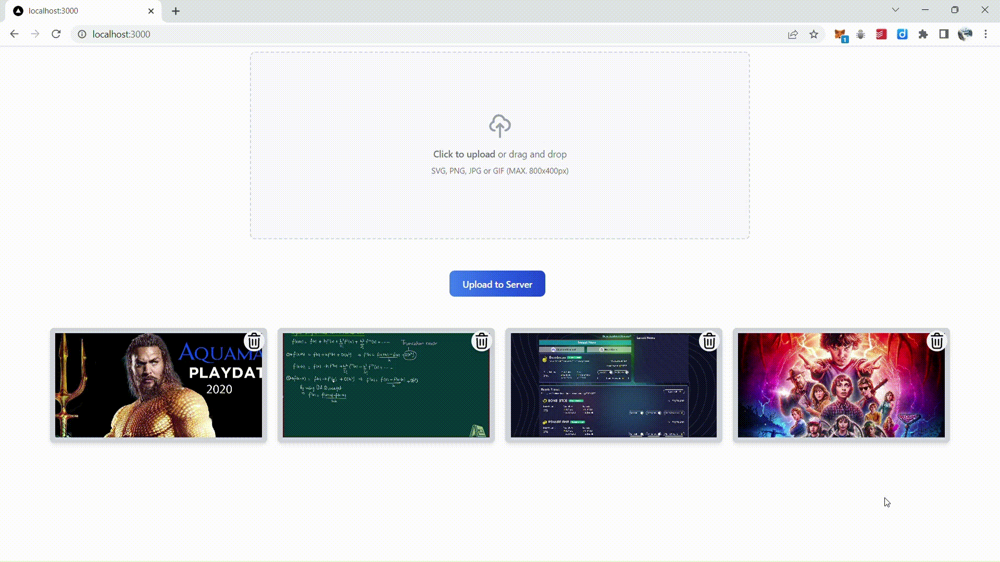

<!-- Heading  -->
# Building your Own Image Server with Node.js and Next.js

<!-- Subtitle -->
A simple image server built with Node.js and Next.js

<!-- Build passing -->
[](https://dinakar.co.in)

<!-- Gif -->


<!-- Write here's the link to the tutorial -->
Here's the link to the tutorial: https://www.youtube.com/

<!-- Table of Contents -->
## Table of Contents
- [Introduction](#introduction)
- [Features](#features)
- [Installation](#installation)
- [Contributing](#contributing)


<!-- Introduction -->
## Introduction
This is a simple image server built with Node.js and Next.js. It is a simple project that I built to learn more about Next.js and how to build a server with it. It is a simple image server that allows you to upload images and then view and also delete them.

<!-- Features -->
## Features
- Upload images with verified API key
- View images
- Delete images with verified API key

<!-- Installation -->
## Installation

#### Create an API key
```javascript
const bcrypt = require('bcryptjs');
// Generate a random 12 byte string
const api_key = bcrypt.hash('random', 12);
// Create an has of the `api_key` and store it in the database
const SECRET_ENCRYPTION_KEY = bcrypt.hash(api_key, 12);
```

#### Installing the backend

1. Go to the backend folder
```sh
cd Backend-NodeJS-Express
```

2. Create a .env file in the backend folder
```sh
touch .env
```

3. Add the following to the .env file
```sh
NODE_ENV=development
PORT=5000
SECRET_API_ENCRYPTION_KEY=SECRET_ENCRYPTION_KEY
```

4. Install NPM packages
```sh
npm install
```
5. Run the server
```sh
npm run dev
```

#### Installing the frontend

1. Go to the frontend folder
```sh
cd frontend-nextjs
```
2. create a .env file in the frontend folder
```sh
touch .env
```
3. Add the following to the .env file
```sh
NEXT_PUBLIC_IMAGE_API_URL=http://localhost:5000
NEXT_PUBLIC_API_KEY=api_key
```

4. Install the packages
```sh
yarn
```
5. Run the server
```sh
yarn dev
```


<!-- Contributing -->
## Contributing
Contributions are what make the open-source community such an amazing place to learn, inspire, and create. Any contributions you make are **greatly appreciated**.

1. Fork the Project
2. Create your Feature Branch (`git checkout -b feature/AmazingFeature`)
3. Commit your changes (`git commit -m 'Add some AmazingFeature'`)
4. Push to the Branch (`git push origin feature/AmazingFeature`)
5. Open a Pull Request

